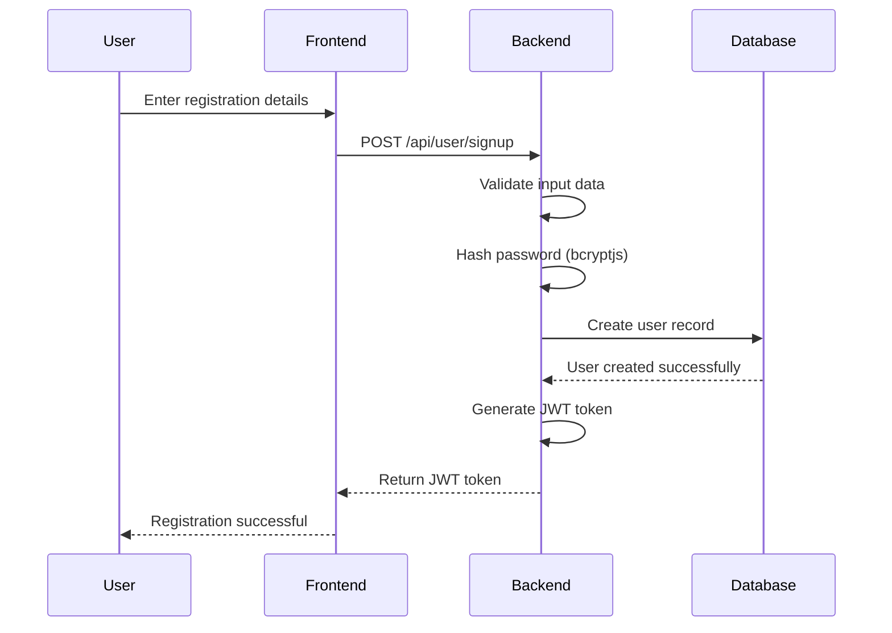
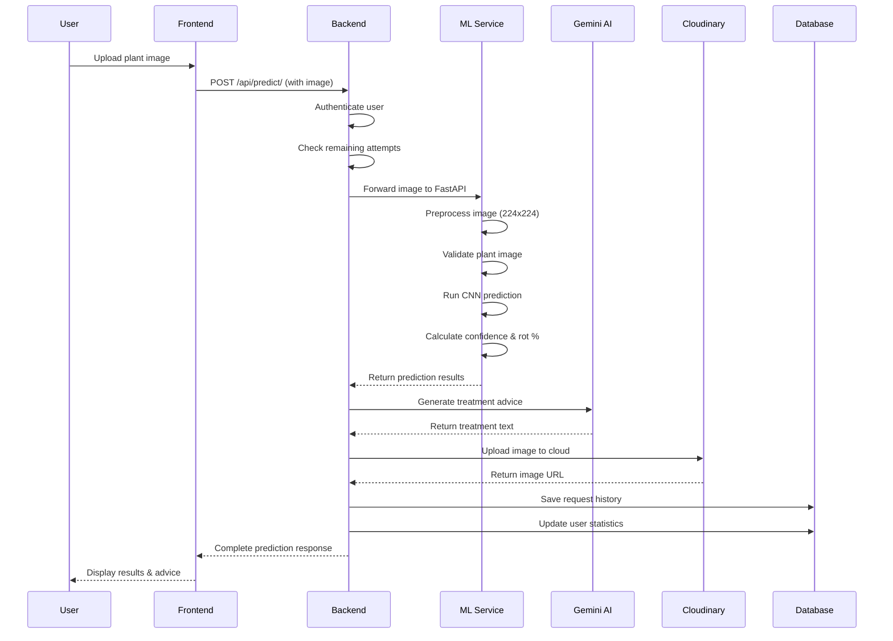
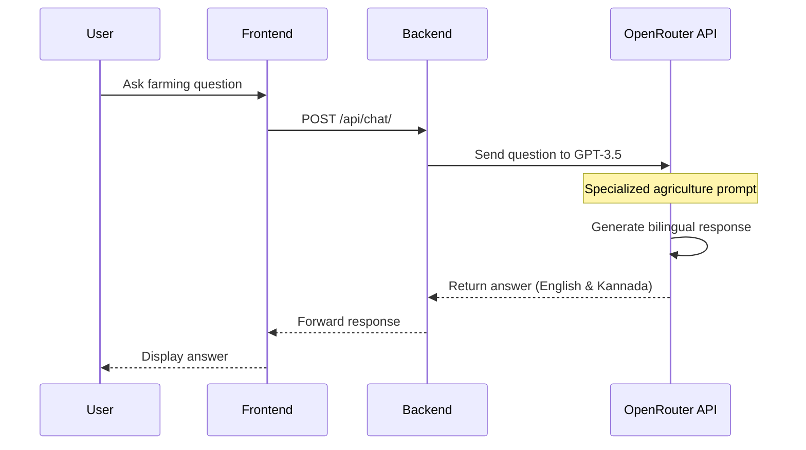
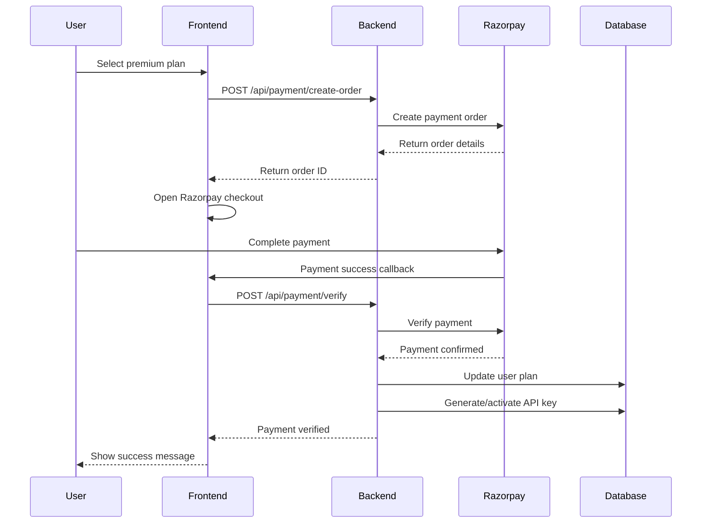

# Farm Assist AI - Complete Project Documentation

## Table of Contents
1. [Project Overview](#project-overview)
2. [System Architecture](#system-architecture)
3. [Technology Stack](#technology-stack)
4. [AI Models and APIs](#ai-models-and-apis)
5. [Project Structure](#project-structure)
6. [System Flow](#system-flow)
7. [API Endpoints](#api-endpoints)
8. [Database Schema](#database-schema)
9. [Installation and Setup](#installation-and-setup)
10. [Usage Guide](#usage-guide)
11. [Security Features](#security-features)
12. [Payment Integration](#payment-integration)
13. [Deployment](#deployment)

## Project Overview

**Farm Assist AI** is a comprehensive agricultural technology platform that leverages artificial intelligence to help farmers identify plant diseases, get treatment recommendations, and access agricultural advice through an intelligent chatbot. The system combines computer vision for disease detection with natural language processing for agricultural consultation.

### Key Features
- **Plant Disease Detection**: AI-powered image analysis to identify 38 different plant diseases
- **Treatment Recommendations**: AI-generated treatment advice using Google Gemini
- **Agricultural Chatbot**: GPT-3.5 powered chatbot for farming queries
- **User Management**: Authentication, API key management, and usage tracking
- **Payment System**: Razorpay integration for premium features
- **Admin Dashboard**: Complete administrative control and analytics
- **Multi-client Support**: Both web interface and API access

### Project Goals
- Assist farmers in early disease detection
- Provide actionable treatment recommendations
- Make agricultural expertise accessible to all farmers
- Track disease patterns and trends
- Generate revenue through premium API services

## System Architecture

### High-Level Architecture

```
┌─────────────────┐    ┌─────────────────┐    ┌─────────────────┐
│                 │    │                 │    │                 │
│   Frontend      │    │   Admin         │    │   Mobile/Web    │
│   (React)       │◄───┤   Dashboard     │    │   Clients       │
│                 │    │   (Next.js)     │    │                 │
└─────────┬───────┘    └─────────────────┘    └─────────┬───────┘
          │                                               │
          │                                               │
          └─────────────┐                   ┌─────────────┘
                        │                   │
                        ▼                   ▼
                ┌─────────────────────────────────┐
                │                                 │
                │        Backend API              │
                │       (Node.js + Express)       │
                │                                 │
                └─────────────┬───────────────────┘
                              │
                              ▼
                ┌─────────────────────────────────┐
                │                                 │
                │       Database Layer            │
                │       (MongoDB Atlas)           │
                │                                 │
                └─────────────┬───────────────────┘
                              │
          ┌───────────────────┼───────────────────┐
          │                   │                   │
          ▼                   ▼                   ▼
┌─────────────────┐ ┌─────────────────┐ ┌─────────────────┐
│                 │ │                 │ │                 │
│   ML Model      │ │   Google        │ │   External      │
│   Service       │ │   Gemini AI     │ │   Services      │
│   (FastAPI)     │ │                 │ │   (Cloudinary)  │
│                 │ │                 │ │                 │
└─────────────────┘ └─────────────────┘ └─────────────────┘
```

### Component Architecture

#### Frontend Layer
- **React Application**: Main user interface
- **Next.js Admin Dashboard**: Administrative interface
- **Responsive Design**: Mobile-first approach

#### Backend Layer
- **Express.js Server**: RESTful API server
- **Middleware Stack**: CORS, Authentication, File Upload
- **Route Handlers**: Modular routing system

#### AI/ML Layer
- **FastAPI Model Service**: Isolated ML model serving
- **Google Gemini Integration**: Treatment recommendations
- **OpenRouter GPT-3.5**: Chatbot functionality

#### Data Layer
- **MongoDB Atlas**: Primary database
- **Cloudinary**: Image storage and management
- **Redis** (optional): Caching layer

## Technology Stack

### Frontend Technologies
- **React 18**: Component-based UI framework
- **Next.js 15**: Full-stack React framework for admin dashboard
- **TypeScript**: Type-safe JavaScript
- **Tailwind CSS**: Utility-first CSS framework
- **Radix UI**: Accessible component library
- **React Hot Toast**: Notification system

### Backend Technologies
- **Node.js**: JavaScript runtime
- **Express.js 4.21**: Web application framework
- **MongoDB 8.12**: NoSQL database
- **Mongoose**: MongoDB object modeling
- **JWT**: JSON Web Tokens for authentication
- **bcryptjs**: Password hashing
- **Multer**: File upload handling
- **CORS**: Cross-origin resource sharing

### AI/ML Stack
- **FastAPI**: High-performance ML API framework
- **Python**: Programming language for ML
- **TensorFlow/Keras**: Deep learning framework
- **MobileNet**: Lightweight CNN architecture
- **PIL (Pillow)**: Python imaging library
- **NumPy**: Numerical computing

### External APIs and Services
- **Google Gemini 1.5 Pro**: Advanced language model
- **OpenRouter GPT-3.5 Turbo**: Conversational AI
- **Cloudinary**: Cloud-based image management
- **Razorpay**: Payment processing
- **MongoDB Atlas**: Cloud database

### DevOps and Tools
- **npm/yarn**: Package management
- **Git**: Version control
- **Environment Variables**: Configuration management
- **RESTful APIs**: Service communication

## AI Models and APIs

### 1. Plant Disease Detection Model
- **Type**: Convolutional Neural Network (CNN)
- **Architecture**: MobileNetV2 (Transfer Learning)
- **Framework**: TensorFlow/Keras
- **Input**: 224x224 RGB images
- **Output**: 38 different plant disease classes
- **Accuracy**: ~95% (varies by disease type)
- **Model File**: `plant_disease_prediction_model_mobilenet.pkl`

#### Supported Plant Diseases (38 Classes):
```
Apple: Scab, Black Rot, Cedar Apple Rust, Healthy
Blueberry: Healthy
Cherry: Powdery Mildew, Healthy
Corn: Cercospora Leaf Spot, Common Rust, Northern Leaf Blight, Healthy
Grape: Black Rot, Esca, Leaf Blight, Healthy
Orange: Huanglongbing (Citrus Greening)
Peach: Bacterial Spot, Healthy
Pepper: Bacterial Spot, Healthy
Potato: Early Blight, Late Blight, Healthy
Raspberry: Healthy
Soybean: Healthy
Squash: Powdery Mildew
Strawberry: Leaf Scorch, Healthy
Tomato: Bacterial Spot, Early Blight, Late Blight, Leaf Mold, 
        Septoria Leaf Spot, Spider Mites, Target Spot, 
        Yellow Leaf Curl Virus, Mosaic Virus, Healthy
```

### 2. Google Gemini 1.5 Pro API
- **Purpose**: Generate treatment recommendations
- **Input**: Disease classification results
- **Output**: Concise treatment advice (max 70 words)
- **API Key**: Configured in environment variables
- **Features**: 
  - Organic treatment options
  - Chemical treatment alternatives
  - Preventive measures

### 3. OpenRouter GPT-3.5 Turbo
- **Purpose**: Agricultural chatbot functionality
- **Model**: `gpt-3.5-turbo`
- **Specialization**: Agriculture and farming expertise
- **Languages**: English and Kannada
- **Features**:
  - Crop management advice
  - Pest control guidance
  - Seasonal farming tips
  - Equipment recommendations

## Project Structure

```
farm_assist_ai/
├── backend/                    # Node.js Backend
│   ├── controllers/           # Route handlers
│   │   ├── admin_controller.js
│   │   ├── chatbotController.js
│   │   ├── paymentController.js
│   │   ├── plantdisease_controller.js
│   │   └── user_controller.js
│   ├── models/               # Database schemas
│   │   ├── RequestTracking.js
│   │   └── user_model.js
│   ├── router/               # Route definitions
│   │   ├── admin_router.js
│   │   ├── chatbotRouter.js
│   │   ├── payment_router.js
│   │   ├── PlantDisease_router.js
│   │   └── user_router.js
│   ├── utils/                # Utility functions
│   ├── conf.env             # Environment configuration
│   ├── server.js            # Main server file
│   └── package.json         # Dependencies
│
├── Model/                     # ML Model Service
│   ├── app.py              # FastAPI application
│   ├── class_indices.json  # Disease class mappings
│   └── plant_disease_prediction_model_mobilenet.pkl
│
├── Admin_dashboard/          # Next.js Admin Interface
│   ├── app/                # App router structure
│   │   ├── layout.tsx     # Root layout
│   │   └── page.tsx       # Login page
│   ├── components/         # Reusable components
│   └── package.json       # Dependencies
│
├── frontend/                 # React User Interface
│   └── README.md
│
└── .gitignore
```

## System Flow

### 1. User Registration and Authentication Flow



### 2. Plant Disease Detection Flow



### 3. Chatbot Interaction Flow



### 4. Payment and API Key Flow



## API Endpoints

### Authentication Endpoints
```
POST /api/user/signup
POST /api/user/login
GET  /api/user/dashboard
```

### Plant Disease Detection
```
POST /api/predict/              # Web interface
POST /api/predict/api-key       # API access
```

### Chatbot
```
POST /api/chat/
```

### Payment System
```
POST /api/payment/create-order
POST /api/payment/verify
```

### Admin Endpoints
```
POST /api/admin/login
GET  /api/admin/dashboard
GET  /api/admin/users
GET  /api/admin/analytics
```

### ML Model Service
```
GET  /                         # Health check
POST /predict1                 # Disease prediction
```

## Database Schema

### User Schema
```javascript
{
  name: String,
  email: String (unique),
  password: String (hashed),
  api_key: String,
  apiKeyActive: Boolean,
  apiUsageCount: Number,
  totalRemaining: Number (default: 5),
  lastRequestAt: Date,
  role: String (enum: ["user", "admin"]),
  createdAt: Date,
  lastRequests: [RequestSchema], // Last 5 requests
  payments: [PaymentSchema]
}
```

### Request Schema
```javascript
{
  imageUrl: String,    // Cloudinary URL
  fileName: String,
  date: Date,
  result: String,      // Disease classification
  confidence: Number   // Prediction confidence
}
```

### Payment Schema
```javascript
{
  paymentId: String,
  plan: String,
  amount: Number,
  date: Date,
  status: String
}
```

### Request Tracking Schema
```javascript
{
  requestType: String, // "web" or "api"
  endpoint: String,
  timestamp: Date
}
```

## Installation and Setup

### Prerequisites
- Node.js 16+
- Python 3.8+
- MongoDB Atlas account
- Google Cloud Platform account (Gemini API)
- OpenRouter account
- Razorpay account
- Cloudinary account

### Backend Setup
```bash
cd backend
npm install
```

Create `conf.env`:
```env
DATABASE_URI=mongodb+srv://...
PORT=8000
OPENROUTER_API_KEY=your_key
JWT_SECRET=your_secret
API_KEY_SECRET=your_secret
RAZORPAY_KEY_ID=your_key
RAZORPAY_KEY_SECRET=your_secret
CLOUD_NAME=your_cloudinary_name
CLOUDINARY_API_KEY=your_key
CLOUDINARY_API_SECRET=your_secret
```

Start backend:
```bash
npm start
```

### ML Model Setup
```bash
cd Model
pip install fastapi uvicorn pillow numpy google-generativeai
python app.py
```

Update `app.py` with your Gemini API key.

### Admin Dashboard Setup
```bash
cd Admin_dashboard
npm install
npm run dev
```

### Frontend Setup
```bash
cd frontend
npm install
npm start
```

## Usage Guide

### For Farmers (Web Interface)
1. **Registration**: Create account with name, email, password
2. **Plant Disease Detection**:
   - Upload clear plant leaf image
   - Get instant disease identification
   - Receive treatment recommendations
   - View confidence score and rot percentage
3. **Chatbot Consultation**:
   - Ask farming questions in English/Kannada
   - Get expert agricultural advice
4. **Premium Upgrade**:
   - Purchase additional API calls
   - Access API key for integration

### For Developers (API Access)
1. **Get API Key**: Upgrade to premium plan
2. **Authentication**: Include API key in requests
3. **Make Predictions**:
   ```bash
   curl -X POST \
   -H "Authorization: Bearer YOUR_API_KEY" \
   -F "image=@plant.jpg" \
   http://localhost:8000/api/predict/api-key
   ```

### For Administrators
1. **Access Dashboard**: Login with admin credentials
2. **Monitor Usage**: View request analytics
3. **User Management**: Manage user accounts
4. **System Health**: Monitor API performance

## Security Features

### Authentication & Authorization
- **JWT Tokens**: Secure user sessions
- **bcryptjs**: Password hashing with salt
- **API Key Validation**: Secure API access
- **Role-based Access**: Admin/user permissions

### Data Protection
- **Input Validation**: Sanitize all user inputs
- **File Type Validation**: Accept only image files
- **Rate Limiting**: Prevent API abuse
- **CORS Configuration**: Control cross-origin requests

### Environment Security
- **Environment Variables**: Secure API key storage
- **Database Security**: MongoDB Atlas encryption
- **HTTPS**: Secure data transmission
- **Cloud Security**: Cloudinary secure URLs

## Payment Integration

### Razorpay Integration
- **Create Order**: Generate payment orders
- **Payment Verification**: Validate payment status
- **Webhook Support**: Real-time payment updates
- **Multiple Plans**: Flexible pricing options

### Pricing Model
- **Free Tier**: 5 free predictions
- **Pro Plan**: 50 additional predictions
- **API Access**: Included with paid plans

## Deployment

### Production Environment Variables
```env
NODE_ENV=production
DATABASE_URI=mongodb+srv://...
Model_Url=https://your-ml-service.com/predict1/
```

### Deployment Options
1. **Backend**: Heroku, AWS, Digital Ocean
2. **ML Model**: Render, Railway, Google Cloud Run
3. **Frontend**: Vercel, Netlify
4. **Admin Dashboard**: Vercel, Netlify
5. **Database**: MongoDB Atlas (cloud)
6. **Storage**: Cloudinary (cloud)

### Performance Optimization
- **Image Compression**: Optimize image uploads
- **Caching**: Implement Redis for frequently accessed data
- **CDN**: Use Cloudinary's CDN for images
- **Load Balancing**: Scale horizontally for high traffic

## Future Enhancements

### Planned Features
- **Mobile App**: React Native application
- **Offline Mode**: Local model inference
- **Weather Integration**: Weather-based recommendations
- **Crop Management**: Complete farm management system
- **Community Features**: Farmer forums and knowledge sharing
- **IoT Integration**: Sensor data incorporation
- **Multi-language Support**: Additional regional languages

### Technical Improvements
- **Model Updates**: Retrain with more disease types
- **Real-time Chat**: WebSocket-based chatbot
- **Push Notifications**: Mobile notifications
- **Advanced Analytics**: Machine learning insights
- **API Rate Limiting**: More sophisticated limiting
- **Microservices**: Break down into smaller services

---

## Contact Information
For technical support or inquiries about the Farm Assist AI project, please contact the development team.

## License
This project is proprietary software. All rights reserved.

---

*Last Updated: October 2024*
*Documentation Version: 1.0*